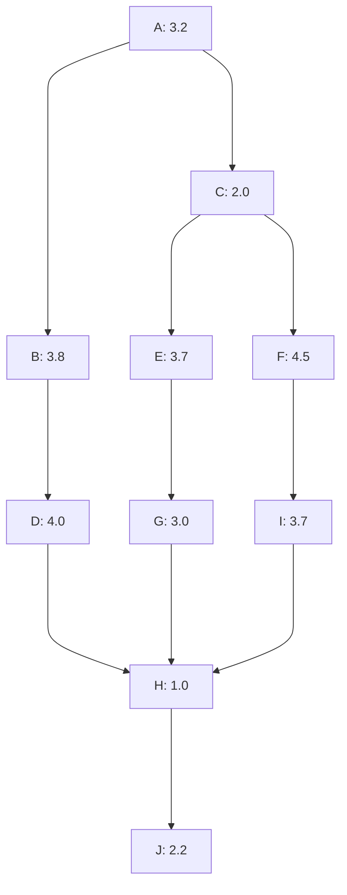

## PERT Diagram

1. Critical-Path: `A-C-F-I-H-J`
2. Slack-Path: `A-B-D-H-J`
3. If activity `E` crashes the critical path will not change.
4. If activity `F` crashes the new critical path becomes `A-C-E-G-H-J`.
