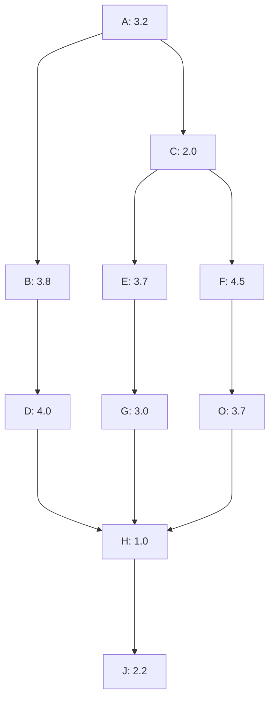

```mermaid
flowchart TD
  A[A: 3.2] ----> B[B: 3.8];
  A ----> C[C: 2.0];
  B ----> D[D: 4.0];
  C ----> E[E: 3.7];
  C ----> F[F: 4.5];
  E ----> G[G: 3.0];
  D ----> H[H: 1.0];
  G ----> H;
  I[O: 3.7] ----> H;
  F ----> I;
  H ----> J[J: 2.2];
```
